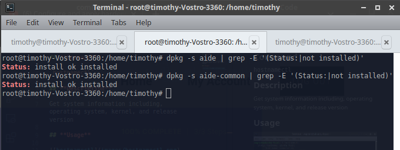

## **Topic**

Ensure AIDE is installed (Automated)

## **Command**

`dpkg -s aide | grep -E '(Status:|not installed)'`

## **Description**

AIDE takes a snapshot of filesystem state including modification times, permissions, and file hashes which can then be used to compare against the current state of the filesystem to detect modifications to the system.

## **Usage**

