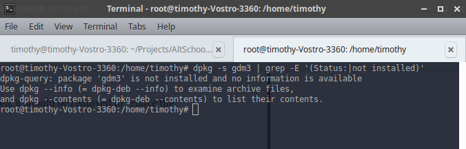

## **Topic**

Ensure GNOME Display Manager is removed (Manual)

## **Command**

`dpkg -s gdm3 | grep -E '(Status:|not installed)'`

## **Description**

The GNOME Display Manager (GDM) is a program that manages graphical display servers
and handles graphical user logins.

## **Usage**

