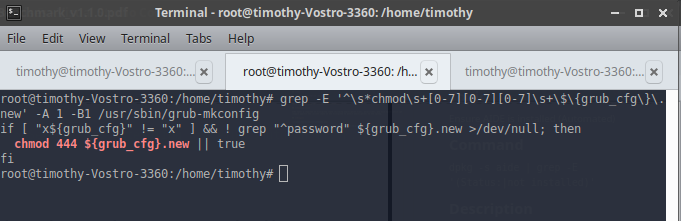

## **Topic**

Ensure permissions on bootloader config are not overridden(Automated)

## **Command**

`grep -E '^\s*chmod\s+[0-7][0-7][0-7]\s+\$\{grub_cfg\}\.new' -A 1 -B1 /usr/sbin/grub-mkconfig`

## **Description**

The permissions on /boot/grub/grub.cfg are changed to 444 when gub.cfg is updated by the update-grub command

## **Usage**

