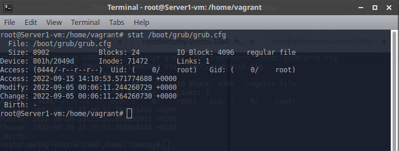

## **Topic**

Ensure permissions on bootloader config are configured(Automated)

## **Command**

`stat /boot/grub/grub.cfg`

## **Description**

The grub configuration file contains information on boot settings and passwords for
unlocking boot options.

## **Usage**

