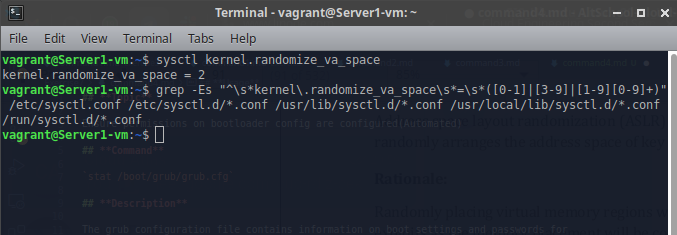

## **Topic**

Ensure address space layout randomization (ASLR) is enabled(Automated)

## **Command**

`sysctl kernel.randomize_va_space`

## **Description**

The grub configuration file contains information on boot settings and passwords for unlocking boot options.

## **Usage**

