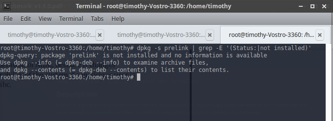

## **Topic**

Ensure prelink is not installed (Automated)

## **Command**

`dpkg -s prelink | grep -E '(Status:|not installed)'`

## **Description**

prelink is a program that modifies ELF shared libraries and ELF dynamically linked binaries in such a way that the time needed for the dynamic linker to perform relocations at startup significantly decreases.

## **Usage**

