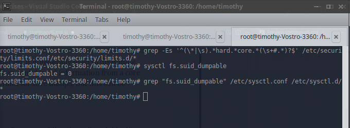

## **Topic**

Ensure core dumps are restricted (Automated)

## **Command**

`grep -Es '^(\*|\s).*hard.*core.*(\s+#.*)?$' /etc/security/limits.conf/etc/security/limits.d/*`  
`sysctl fs.suid_dumpable`  
`grep "fs.suid_dumpable" /etc/sysctl.conf /etc/sysctl.d/*`

## **Description**

A core dump is the memory of an executable program. It is generally used to determine
why a program aborted. It can also be used to glean confidential information from a core
file. The system provides the ability to set a soft limit for core dumps, but this can be
overridden by the user.

## **Usage**

