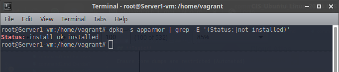

## **Topic**

Ensure AppArmor is installed (Automated)

## **Command**

`dpkg -s apparmor | grep -E '(Status:|not installed)'`

## **Description**

AppArmor provides Mandatory Access Controls.

## **Usage**

