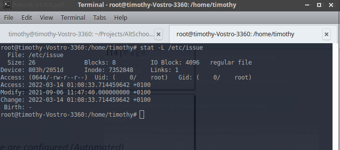

## **Topic**

Ensure permissions on /etc/issue are configured (Automated)

## **Command**

`stat -L /etc/issue`

## **Description**

The contents of the /etc/issue file are displayed to users prior to login for local terminals.

## **Usage**

